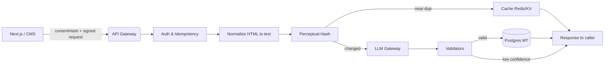

# Accessaurus

**Accessaurus** is a drop‑in, server‑first SDK for **Next.js & Web** that generates:

* **SEO meta** (title, description, social cards),
* **Schema.org JSON‑LD** (Article/Product/Event/FAQ/HowTo),
* **Query expansion & synonyms** for on‑site search.

It’s **multi‑tenant**, **idempotent**, and **secure by design** (no secrets in the browser). When inputs are incomplete or confidence is low, it returns **`null`** instead of guessing.

## Why teams use Accessaurus

* **Fewer manual edits:** consistent titles/descriptions and validated JSON‑LD.
* **Safer automation:** schema‑validated outputs; no hallucinated facts.
* **Predictable cost:** deduped by content hash + perceptual hashing; cache hits are free.
* **Simple integration:** one SDK call in `generateMetadata()` (Next.js) or via CMS webhook.

## Core capabilities

### Meta Tag Writer

**Input:** page URL + canonical, primary H1, summary/body, brand rules
**Output:** `{ title, description, ogTitle, ogDescription, twitterCard, canonical }`
**Rules:** strict lengths; brand lexicon enforcement; duplicates avoided.

### Schema.org JSON‑LD Generator

**Input:** page type + content (Article/Product/Event/FAQ/HowTo)
**Output:** validated JSON‑LD or `null` if required fields are missing/low confidence.
**Usage:** embed as a `<script type="application/ld+json">…</script>` server‑side.

### Query Expansion & Synonyms

**Input:** search logs + taxonomy
**Output:** curated synonym sets and redirects (e.g., “sneakers” ↔ “trainers”), **gated by review** before activation.

## How it works (high‑level)



**Key ideas**

* **Content hash** + **Idempotency‑Key** prevent double work/charges.
* **Perceptual hashing** (SimHash) skips regeneration for trivial edits.
* **Structured Outputs** + **JSON Schema** ensure reliable, typed results.
* **Confidence gate:** low confidence ⇒ return `null`.

## Installation & Usage

```bash
npm install @accessaurus/react
# or
bun add @accessaurus/react
```

### The simplest SDK ever

```tsx
// app/layout.tsx
import { Accessaurus } from '@accessaurus/react';

export default function Layout({ children }) {
  return (
    <html>
      <head>
        {/* That's it. Seriously. */}
        <Accessaurus />
      </head>
      <body>{children}</body>
    </html>
  );
}
```

That's all. The `<Accessaurus />` component:
- ✅ Auto-generates WCAG-compliant meta tags
- ✅ Creates Schema.org JSON-LD based on your content
- ✅ Optimizes for screen readers
- ✅ Structures data for AI comprehension  
- ✅ Returns `null` if confidence is low (never hallucinates)

### What it generates automatically

```html
<!-- From just <Accessaurus />, you get: -->

<meta name="description" 
      content="Clear, screen-reader-friendly description">
<meta property="og:title" 
      content="Accessible, social-optimized title">
<meta property="og:description" 
      content="Description that works for everyone">

<script type="application/ld+json">
{
  "@context": "https://schema.org",
  "@type": "Article",
  "headline": "Auto-detected from your content",
  "accessibilityFeature": ["readingOrder", "ARIA"],
  "accessibilityHazard": "none"
}
</script>
```

### Advanced usage (optional)

```tsx
// Only if you need custom configuration
<Accessaurus 
  config={{
    tone: 'clear',           // optimized for clarity
    maxTitle: 60,            // WCAG recommended
    screenReaderFirst: true  // default
  }}
/>
```

## I/O contracts (schemas enforced)

### MetaResult (JSON Schema)

```json
{
  "type":"object","required":["title","description","ogTitle","ogDescription","twitterCard"],
  "properties":{
    "title":{"type":"string","maxLength":60},
    "description":{"type":"string","minLength":70,"maxLength":160},
    "ogTitle":{"type":"string","maxLength":70},
    "ogDescription":{"type":"string","minLength":70,"maxLength":200},
    "twitterCard":{"type":"string","enum":["summary","summary_large_image"]},
    "canonical":{"type":"string","format":"uri"}
  },
  "additionalProperties":false
}
```

### JSON‑LD (per type)

* **Article:** requires `headline`, `datePublished`, `author.name`, `mainEntityOfPage.@id`
* **FAQPage:** array of `{ @type:"Question", name, acceptedAnswer.text }`
* **Product:** `name` + at least one of `sku|gtin|mpn`
* **Event:** `name`, `startDate`, `location`
* **HowTo:** `name`, `step[]`

If required fields are missing or confidence is low ⇒ **`null`**.

## Request flow (Meta)


## Guardrails & quality

* **Structured outputs**: LLM returns JSON matching our schema (not free text).
* **Validation pipeline**: AJV + heuristics (lengths, no duplication, brand rules).
* **Confidence scoring**: model self‑score × field completeness × heuristic score.
  Threshold configurable per tenant; below threshold → **`null`**.
* **Perceptual hashing**: SimHash over 3–5‑gram shingles of normalized text; if Hamming distance ≤ **N** (e.g., 3), reuse the previous output.

## Security model

* **Server‑to‑server only** for metered endpoints (default).
* **HMAC‑signed requests** with timestamp + nonce; 5‑minute skew; single‑use nonce.
* **Domain verification** (DNS TXT or `/.well-known/accessaurus.txt`); all calls include `domain` claim, enforced per tenant.
* **Optional** client flow: **single‑use JWT** (60–120s TTL) scoped to `meta:generate` and bound to `tenantId + domain + path + contentHash`.
* **Origin/Referer** checked as defense‑in‑depth (not primary auth).
* **PII redaction** in ingestion unless required by JSON‑LD type.
* **No secrets in the browser.**

## Billing & quotas

* **Units billed:** successful, **non‑cached** `MetaResult` or `JSON‑LD` block; synonyms billed per **N** log rows processed + per **approved** synonym set.
* **Idempotency** dedupes retries; cache hits are **free**.
* **Usage ledger** records tokens, cost, idempotency key; **soft/hard caps** per tenant.

## Observability

* Metrics: latency (p50/p95/p99), cache hit rate, retry counts, confidence distribution, tokens/cost.
* Tracing: request id + idempotency key across gateway→workers→DB.
* Audit log: who/what/when for generated outputs; approval events for synonyms/JSON‑LD.

## Example prompts (conceptual)

> *System:* “You are Accessaurus. Produce SEO meta compliant with the provided JSON Schema. Use only facts in the input. If required fields are missing or uncertain, return `null`.”
> *User content:* `{ url, canonical, h1, summary, body, brandRules }`
> *Response format:* **JSON Schema** (MetaResult)

## Example outputs

**MetaResult**

```json
{
  "title": "Scaling Postgres for Multi‑tenant SaaS",
  "description": "A practical guide to sharding, noisy‑neighbor isolation, and schema design for multi‑tenant Postgres at scale.",
  "ogTitle": "Scaling Postgres for Multi‑tenant SaaS",
  "ogDescription": "Architectures, trade‑offs, and runbooks to keep latency low while costs stay predictable.",
  "twitterCard": "summary_large_image",
  "canonical": "https://example.com/blog/scaling-postgres"
}
```

**FAQPage JSON‑LD**

```json
{
  "@context": "https://schema.org",
  "@type": "FAQPage",
  "mainEntity": [
    {
      "@type": "Question",
      "name": "What is multi‑tenant Postgres?",
      "acceptedAnswer": { "@type": "Answer", "text": "…" }
    }
  ]
}
```

## Roadmap

* Additional JSON‑LD types (Organization, BreadcrumbList, VideoObject).
* Localized meta & hreflang sets.
* PR bot: comments with proposed meta/JSON‑LD diffs during CI.
* Admin review UI for JSON‑LD & synonym approvals (bulk actions, rationale).

## FAQ

**Q: Can someone steal a “public key” and charge another tenant?**
**A:** No. Metered endpoints require **server‑to‑server HMAC** (or a short‑lived **single‑use JWT**). We also bind tenants to **verified domains** and use **nonce** replay protection.

**Q: What if inputs are too thin?**
**A:** We return **`null`** and do **not** charge. You can fall back to your current metadata.

**Q: Will small typos re‑trigger generation?**
**A:** The **perceptual hash** checks similarity. If it’s a near‑duplicate (e.g., Hamming distance ≤ 3), we reuse the previous output.

**Q: Can we review synonyms before they go live?**
**A:** Yes. Synonyms are **gated by review**; only approved sets are exported/served.

> Accessaurus = **server‑first**, **schema‑validated**, **idempotent** automation for meta, JSON‑LD, and synonyms—built to be safe, predictable, and easy to drop into your Next.js/Web stack.
