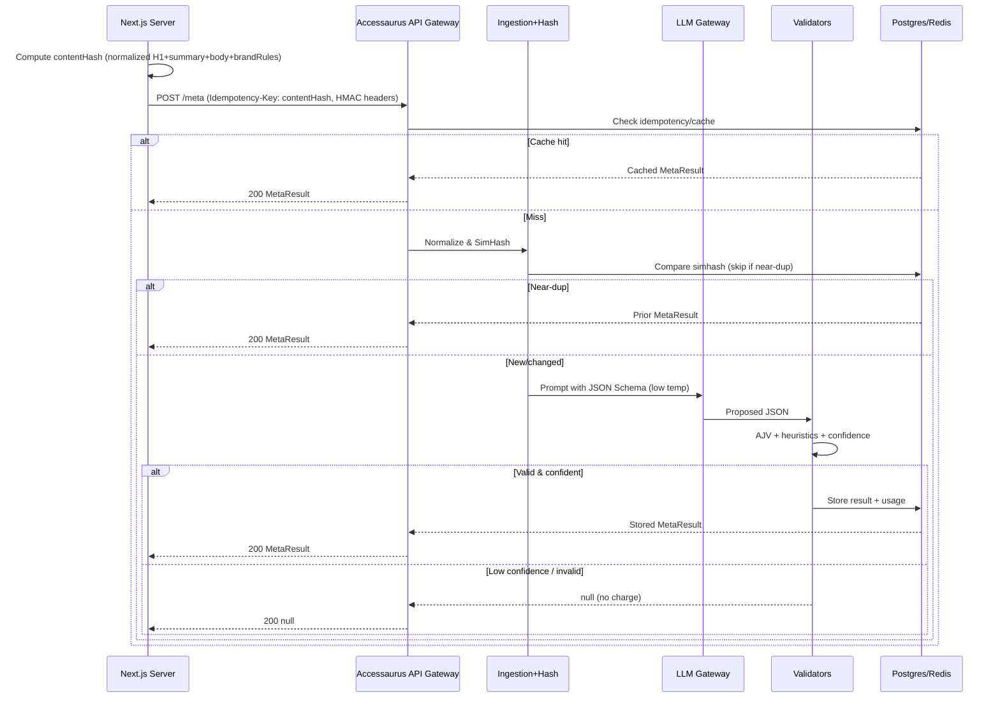
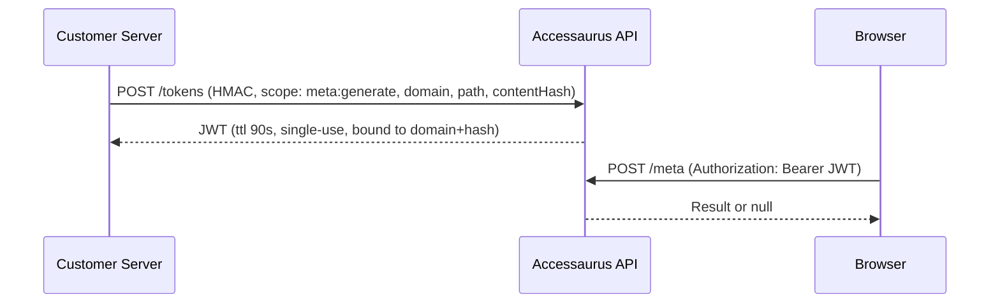
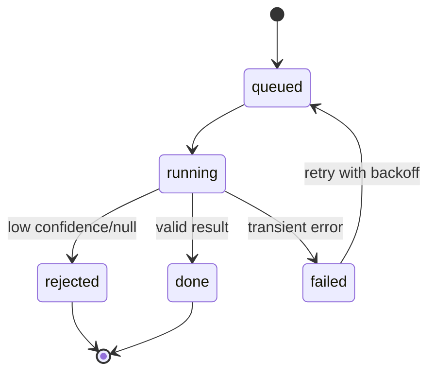

# ADR‑0001 — Accessaurus SDK Architecture (Meta Writer, JSON‑LD, Synonyms)

**Date:** 2025‑09‑05
**Owners:** Sunghyun Cho
**Decision Scope:** B2B “drop‑in” SDK for Next.js/Web that generates (a) SEO meta (title/description/social cards), (b) Schema.org JSON‑LD, and (c) query expansion/synonyms—securely, predictably, and cost‑aware.

## Context & Problem

We need a production‑grade system that lets customers drop a single SDK into a Next.js/Web app and receive:

* **Meta tag writer** at build time (ISR/SSG) or on publish.
* **Schema.org JSON‑LD** blocks (Article/Product/Event/FAQ/HowTo).
* **Synonyms & redirects** for on‑site search (reviewed before going live).

Constraints:

* Multi‑tenant B2B; **no secrets in the browser**.
* Deterministic, **idempotent** generation; avoid re‑charging for trivial edits.
* **Guardrails:** when inputs are incomplete or confidence is low, return `null` (don’t guess).
* Customers want **control** (review UI, brand rules) and **predictable costs**.
* Prevent **key theft** and **billing abuse**; domain alone is not sufficient.

## Decision Summary

We will build **Accessaurus** as a **server‑first, multi‑tenant** platform with:

1. **SDK (server helpers + optional React wrapper)** that computes a **content hash**, calls our **server API** with an **Idempotency‑Key**, and never exposes customer secrets in the browser.
2. **API Gateway** with **HMAC‑signed requests**, optional **ephemeral JWTs** for rare client calls, **domain verification**, **rate limiting**, and **idempotency**.
3. **Ingestion Normalizer** (HTML→safe text, boilerplate stripping, PII redaction) feeding a **Perceptual Hash Layer** (SimHash/MinHash) to skip LLM if edits are trivial.
4. **LLM Gateway** that uses **structured outputs (JSON Schema)**, **low temperature**, and **automatic validation** (AJV + heuristics + confidence scoring). If validation fails → retry; if still low confidence → **return `null`**.
5. **Cache (Redis/KV)** and **Postgres** (tenants, domains, keys, outputs, usage ledger).
6. **Job queue & workers** for on‑publish and ISR/SSG pre‑warming; **review UI** for JSON‑LD & synonyms before activation.
7. **Billing** on **successful, non‑cached generations**, deduped by **Idempotency‑Key/content hash**, with hard/soft budget caps.

## Quality Attributes

* **Security:** HMAC‑signed, nonce’d requests; domain verification; optional short‑lived JWTs; server‑only secrets.
* **Cost control:** cache by content hash; perceptual hashing to skip re‑gens; idempotency; budgets/quotas.
* **Reliability:** retries with backoff; dead‑letter queue; deterministic schemas.
* **Compliance/Accessibility:** returns `null` if uncertain (no hallucinated JSON‑LD); brand rules enforced.
* **Observability:** audit logs, usage ledger, latency and token metrics, confidence scores.

## Architecture Overview

```mermaid
flowchart LR
  A[Customer App (Next.js)] -->|generateMetadata()/webhook| B(API Gateway)
  B --> C[AuthN/AuthZ\n(HMAC, domain verify,\nrate limit, idempotency)]
  C --> D[Ingestion Normalizer\n(HTML->text, PII redact)]
  D --> E[Perceptual Hash Layer\n(SimHash/MinHash)]
  E -->|near-dup| H[Hot Cache (Redis/KV)]
  E -->|new/changed| F[LLM Gateway\n(JSON Schema)]
  F --> G[Validators\n(AJV + heuristics + confidence)]
  G -->|valid| I[(Postgres MT)\n(outputs, usage, jobs)]
  H --> J[Response]
  I --> J[Response]
  G -->|low confidence| J
  C <-- K[Job Queue/Workers\n(SSR/ISR, CMS publish)]
  I <-- K
```

## Key Flows

### Meta Writer (build/ISR or CMS publish)



### Optional client call with ephemeral token (rare)



## Data Model (essentials)

```mermaid
erDiagram
  TENANTS ||--o{ API_KEYS : possesses
  TENANTS ||--o{ DOMAINS : owns
  TENANTS ||--o{ PAGES : has
  PAGES ||--o{ META_OUTPUTS : produces
  PAGES ||--o{ JSONLD_OUTPUTS : produces
  TENANTS ||--o{ SYNONYM_SETS : curates
  TENANTS ||--o{ USAGE_LEDGER : accrues
  TENANTS ||--o{ JOBS : schedules
  TENANTS ||--o{ AUDIT_LOG : writes

  TENANTS { uuid id PK
            text name
            text plan
            int budget_cents }

  API_KEYS { uuid id PK
             uuid tenant_id FK
             text key_hash
             text type // secret|publishable
             text scopes
             timestamptz created_at
             timestamptz disabled_at }

  DOMAINS { uuid id PK
            uuid tenant_id FK
            text domain
            text verification_token
            timestamptz verified_at }

  PAGES { uuid id PK
          uuid tenant_id FK
          text domain
          text path
          text last_content_hash
          bigint last_simhash }

  META_OUTPUTS { uuid id PK
                 uuid page_id FK
                 text content_hash
                 jsonb json
                 float confidence
                 text model
                 int tokens_in
                 int tokens_out
                 int cost_cents
                 timestamptz created_at }

  JSONLD_OUTPUTS { uuid id PK
                   uuid page_id FK
                   text content_hash
                   text kind
                   jsonb json
                   float confidence
                   bool approved }

  SYNONYM_SETS { uuid id PK
                 uuid tenant_id FK
                 text[] terms
                 float confidence
                 bool approved }

  USAGE_LEDGER { uuid id PK
                 uuid tenant_id FK
                 text unit // meta,jsonld,syn_batch
                 int quantity
                 text idempotency_key
                 int cost_cents
                 timestamptz created_at }

  JOBS { uuid id PK
         uuid tenant_id FK
         text kind
         text content_hash
         text status // queued, running, done, failed, dead
         int attempts }
```

## Public API (server‑to‑server)

* `POST /meta` → `MetaResult | null`
* `POST /jsonld` → `{ kind, json } | null`
* `POST /synonyms/suggest` (batch/offline) → candidate sets for review
* `POST /webhooks/publish` (from CMS) → enqueues jobs
* **Headers:** `Authorization: Bearer <secret>`, `Idempotency-Key: <contentHash>`, `X-Timestamp`, `X-Nonce`, `X-Signature` (HMAC of body)
* **Errors:** 4xx for validation/auth; 409 on idempotency collision; 429 on rate‑limit.

## SDK Surface (server‑first)

* `meta.generate({url, canonical, h1, summary, body, brandRules}): Promise<MetaResult|null>`
* `jsonld.generate(type, content): Promise<{kind,json}|null>`
* `synonyms.submitLogs(batch)`, `synonyms.listPending()`, `synonyms.approve(id)`
* Utilities: `computeContentHash()`, `normalizeHtmlToText()`

**Lengths enforced in schema:**

* `title ≤ 60`, `description 70–160`, `ogTitle ≤ 70`, `ogDescription 70–200`, `twitterCard ∈ {summary, summary_large_image}`.

## Security & Abuse Prevention

* **Do NOT expose secrets in browser.** All metered calls are server‑to‑server where possible.
* **HMAC‑signed requests** (timestamp + nonce; 5‑min skew; single‑use nonce bucketed in Redis).
* **Domain verification** via DNS TXT or `/.well‑known/accessaurus.txt`; bind **tenant↔domain** and require `domain` claim in each call.
* **Optional ephemeral JWTs** (single‑use, 60–120s) bound to `tenantId`, `domain`, `path`, `contentHash`, and `scope`.
* **Origin/Referer** checked (defense‑in‑depth; not sole auth).
* **Prompt‑injection mitigation:** only pass normalized text; strip scripts/links; denylist HTML attrs; never execute returned output.
* **PII redaction** unless specifically required by JSON‑LD type.
* **RBAC** in Admin: key rotation, scoped keys (`meta`, `jsonld`, `synonyms`), read‑only keys.

## Billing & Metering

* **Unit of billing:** successful **non‑cached** `MetaResult`, `JSON‑LD` block; synonyms priced per **N log rows processed** + per **approved set**.
* **Idempotency** prevents double charges; **cache hits** are free.
* **Usage ledger** records tokens, cost\_cents, idempotency\_key; soft/hard **budget caps**; 402/limit when exceeded.
* **Retry policy:** if final result is `null` due to low confidence → **no charge** (but log incident).

## Validation & Guardrails

* **Structured outputs (JSON Schema)** at the LLM boundary.
* **AJV validation** + heuristic checks (lengths, banned words, duplicates, tone rules).
* **Confidence score** = model self‑score (0–1) × completeness × heuristic quality. Threshold configurable; below threshold → `null`.
* **Perceptual Hashing:**

  * Compute SimHash on 3‑5‑gram shingles of normalized body.
  * If Hamming distance ≤ N (e.g., 3) vs previous → return prior output.
* **Safe defaults:** If `canonical` missing, default to `url`. If inputs too short, return `null`.

## Operations & Observability

* **Metrics:** latency, p95/p99, cache hit rate, retry counts, confidence distribution, cost/token curves.
* **Tracing:** request id, idempotency key, content hash through gateway → workers → DB.
* **Logs:** redacted structured logs; PII filtering.
* **SLOs:** 99.9% availability for gateway; p95 < 800ms on cache hits; p95 < 3s on cold meta.

## Risks & Mitigations

| Risk                                 | Mitigation                                                                                    |
| ------------------------------------ | --------------------------------------------------------------------------------------------- |
| Key theft via exposed public key     | Server‑only secret; HMAC; ephemeral JWTs; domain binding; nonce replay protection             |
| Prompt injection via DOM             | Normalize to text; strip HTML; deny external URLs; enforce schema; return `null` on anomalies |
| Over‑generation costs on small edits | SimHash/MinHash + idempotency by content hash                                                 |
| Hallucinated JSON‑LD                 | Strict required fields; confidence threshold; human review gate                               |
| Cache poisoning                      | Idempotency keys tied to content hash; per‑tenant namespaces; signatures verified             |
| Latency spikes                       | Pre‑warm via CMS webhook; queue with concurrency control; aggressive caching                  |

## Alternatives Considered

1. **Client‑side LLM calls** with publishable key
   **Rejected:** secret exposure, billing abuse, lack of idempotency.

2. **Domain check only** (no HMAC/JWT)
   **Rejected:** trivially spoofable via headless client or forged headers.

3. **Free‑text LLM + “JSON mode”**
   **Rejected:** brittle; schema mismatch. **Structured outputs** + AJV chosen.

4. **Always regenerate** (no perceptual hashing)
   **Rejected:** cost blow‑ups for typo edits, noisy CMS diffs.

5. **Edge‑only runtime**
   **Deferred:** Gateway can run at edge; validators/LLM calls often need region‑pinned infra. We’ll colocate near LLM region; edge fan‑out optional later.

## Non‑Goals

* Full accessibility auditing beyond the specified guardrails (separate product track).
* Personalized ranking or semantic search engine; we only **export synonyms/redirects**.
* WYSIWYG authoring UI (beyond a minimal review/approval console).

## Acceptance Criteria

* **Meta:** For valid inputs, ≥95% of outputs pass AJV+heuristics; lengths respected; cache/idempotency prevents duplicate charges.
* **JSON‑LD:** For each supported type, reject incomplete inputs with `null`; approved blocks validate in Rich Results tests (internal harness).
* **Synonyms:** Candidate sets generated nightly; review UI enables approve/reject; only approved sets served/exported.
* **Security:** Successful DNS verification flow; HMAC signature check; replay prevention with nonce; optional JWT path works.
* **Ops:** Dashboard shows usage, costs, cache rate; budgets enforce hard stop.

## Implementation Notes

* Start with **Article** and **FAQPage** JSON‑LD types (highest ROI), then **Product**, **Event**, **HowTo**.
* SimHash parameters: 64‑bit, 5‑gram shingles over normalized body; Hamming threshold 3 (tunable).
* Heuristics: description must not repeat title verbatim; avoid boilerplate (“Learn more”, “Click here”); enforce brand lexicon if provided.

## Job Lifecycle



## Appendix — Schemas (abridged)

**MetaResult**

```json
{
  "type":"object","required":["title","description","ogTitle","ogDescription","twitterCard"],
  "properties":{
    "title":{"type":"string","maxLength":60},
    "description":{"type":"string","minLength":70,"maxLength":160},
    "ogTitle":{"type":"string","maxLength":70},
    "ogDescription":{"type":"string","minLength":70,"maxLength":200},
    "twitterCard":{"type":"string","enum":["summary","summary_large_image"]},
    "canonical":{"type":"string","format":"uri"}
  },
  "additionalProperties":false
}
```

**JSON‑LD (per type, required fields enforced)**

* `Article`: `headline`, `datePublished`, `author.name`, `mainEntityOfPage.@id`
* `FAQPage`: array of `{ @type: "Question", name, acceptedAnswer.text }`
* `Product`: `name`, `sku|gtin|mpn (≥1)`, optional `offers`
* `Event`: `name`, `startDate`, `location`
* `HowTo`: `name`, `step[]`

### Final Notes

This ADR commits us to a **server‑first, schema‑validated, idempotent** architecture with strong auth and perceptual hashing to control cost. It directly answers the key concern: **no one can steal a “public key” to charge others** because metered access requires **server‑side HMAC‑signed requests** (or a **single‑use JWT** bound to domain+hash) and **domain verification**.
